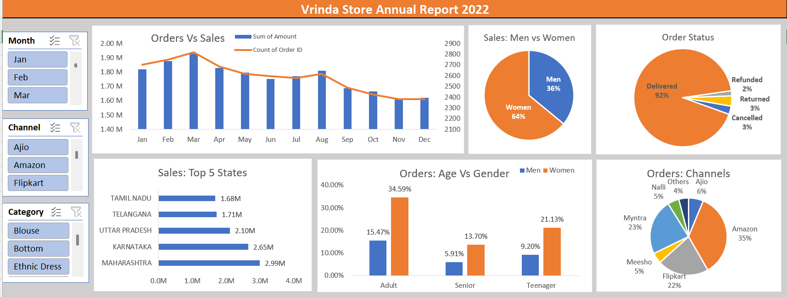

# Vrinda-Store-Sales-Analysis
Excel dashboard project analyzing Vrinda Store sales data.

# 📊 Vrinda Store Sales Analysis (Excel Dashboard)

## 📌 Project Overview

This project analyzes the annual sales performance of **Vrinda Store** using Microsoft Excel.
The objective of this project is to identify key sales trends, customer behavior, and channel performance to support better business decision-making.

An interactive dashboard was created using **Pivot Tables, Pivot Charts, and Excel visualization tools** to provide insights into sales, orders, customer demographics, and regional performance.

---

## 🛠 Tools & Technologies Used

* Microsoft Excel
* Data Cleaning
* Pivot Tables
* Pivot Charts
* Dashboard Design

---

## 📷 Dashboard Preview

---

## 📊 Key Business Insights

### 1. Women Customers Drive the Majority of Sales

Women contribute **64% of total sales**, while men account for **36%**.
This indicates that the primary customer segment is women.

### 2. Amazon is the Top Sales Channel

Amazon generates **35% of total orders**, making it the most important sales channel, followed by **Myntra (23%)** and **Flipkart (22%)**.

### 3. Maharashtra Generates the Highest Revenue

Among all states, **Maharashtra contributes the highest sales**, followed by Karnataka and Uttar Pradesh.

### 4. Adult Women are the Dominant Buyers

The **adult age group (especially women)** accounts for the highest number of orders, indicating strong demand from this demographic.

### 5. High Order Fulfillment Rate

Approximately **92% of orders are successfully delivered**, while only a small percentage are cancelled, returned, or refunded.

### 6. Seasonal Sales Trend

Sales peak during the **early months of the year**, particularly around **March**, and gradually decline toward the later months.

---

## 📈 Business Recommendations

* Focus marketing efforts on **women customers**, especially in the adult segment.
* Strengthen product listings and advertisements on **Amazon**, the leading sales channel.
* Increase marketing and inventory in **high-performing states like Maharashtra and Karnataka**.
* Improve product descriptions and size guides to **reduce returns**.
* Plan promotions and discounts during **low-sales months** to maintain steady revenue.

---

## 📁 Project Files

* Vrinda Store Dataset
* Excel Dashboard
* Dashboard Screenshot

---

## 🎯 Conclusion

This project demonstrates how Excel dashboards can be used to transform raw sales data into meaningful business insights that support data-driven decision-making.
